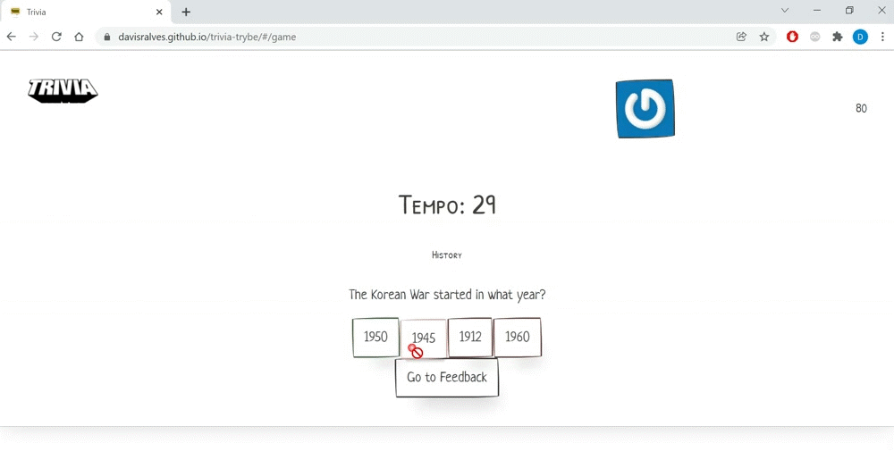
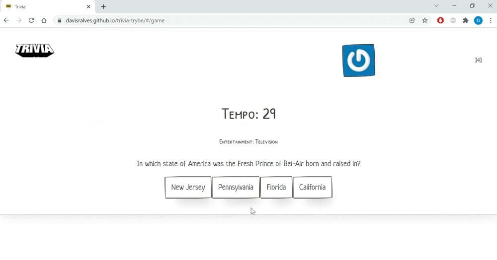
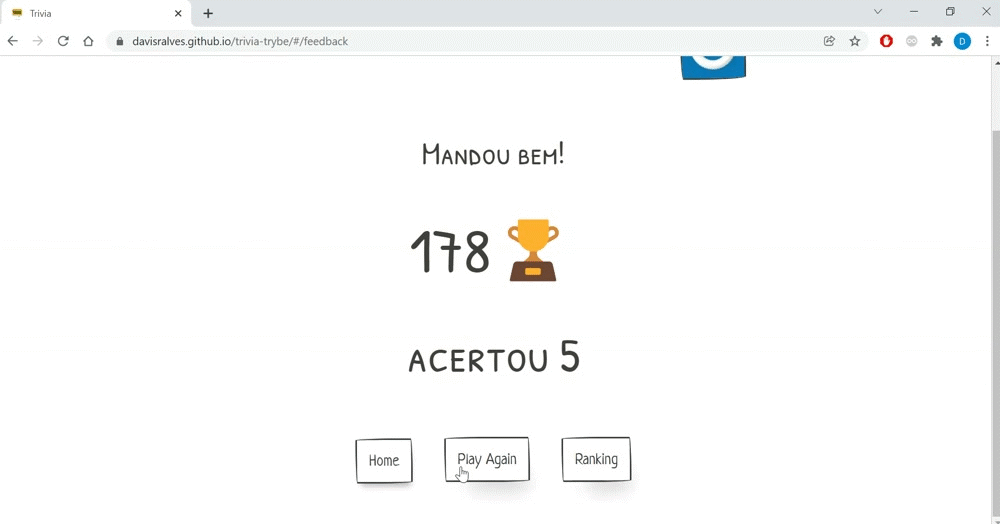
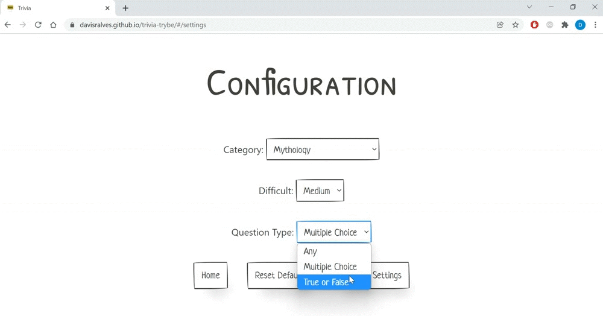

# Trivia Game Project

## Description

This project is a group-developed trivia game using React and Redux. Contributors: [Davi Alves](https://github.com/Davisralves), [Nasser Almeida](https://github.com/nasseralm), [Matheus Rodrigues](https://github.com/matheus-luz), [Breno Matias](https://github.com/brenoMatias), and [Ana Alice Honório](https://github.com/Ana-Alice-Honorio).

## Live Demo

[Click Here to Play](https://davisralves.github.io/trivia-trybe/)

## Technologies Used

- React
- Redux
- React Router
- CSS
- [PaperCSS](https://www.getpapercss.com/)
- ESLint
- Trello

## Project Overview

The trivia game uses the [Open Trivia API](https://opentdb.com/api_config.php) and was developed collaboratively using agile methodologies (Scrum and Kanban) with Trello for task management. The project started by following the requirements from [this repository](https://github.com/tryber/sd-014-b-project-trivia-react-redux#api-de-trivia) but was completed with additional features.

### Login Screen:

The game has a login screen where the user can enter their name and email. The email is used to request the user's Gravatar photo, which appears during the game and on the feedback screen. This is done through the API provided by [Gravatar](https://br.gravatar.com/), where users can register and have their profile picture displayed in the trivia game.

<details>
<summary>Login Gif</summary>


</details>

### Game Screen:

The game features 5 questions of varying difficulty levels, from easy to hard. Questions can be multiple-choice or true/false. Players earn points for each correct answer, based on the time taken to answer and the difficulty of the question.

<details>
<summary>Game Gifs</summary>


</details>

### Feedback Screen:

The feedback screen shows the number of correct answers and provides a message to the player based on their performance.

<details>
<summary>Feedback Gifs</summary>




</details>

### Ranking Screen:

The ranking screen displays the leaderboard of players.

<details>
<summary>Ranking Gif</summary>


</details>

### Settings Screen:

The settings screen offers 3 options to configure the trivia game: by difficulty, category, and type of question. If there are not enough questions for the selected configuration, the player will receive a message informing them of this.

<details>
<summary>Settings Gif</summary>



</details>

### Instructions to Install and Run the Project.

1. Clone the repository:
   * ``` git clone git@github.com:Davisralves/trivia-trybe.git ```
   * Navigate to the cloned repository folder:
     * cd cd trivia-trybe

2. Install the dependencies
   * ``` npm install ```
   * ``` npm start  (A new page should open in your browser with the application running) ```

## Project Status
 Completed

