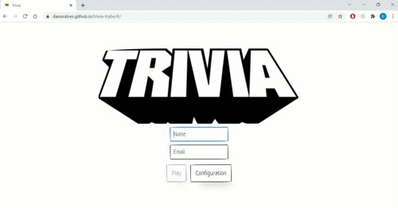

# Projeto jogo Trivia

## Descrição

Projeto de criação de um jogo trivia em grupo com [Davi Alves](github.com/Davisralves), [Nasser Almeida](https://github.com/nasseralm), [Matheus Rodrigues](https://github.com/matheus-luz), [Breno Matias](https://github.com/brenoMatias) e [Ana Alice Honório](https://github.com/Ana-Alice-Honorio) com React e Redux.

## Link
 [Clique Aqui](https://davisralves.github.io/trivia-trybe/)

## Tecnologias Utilizadas
 * React
 * Redux
 * React-router
 * Css
 * [PaperCss](https://www.getpapercss.com/)
 * ESLint
 * Trello

## O que foi desenvolvido
 Foi desenvolvido o jogo trivia com a utilização da API [Open_trivia](https://opentdb.com/api_config.php) em grupo utilizando metodologias ageis (scrum e kanban) com   auxilio do trello. Esse projeto começou seguindo os passos e requisitos desse [Repositorio](https://github.com/tryber/sd-014-b-project-trivia-react-redux#api-de-trivia) mas foi finalizado com implementações adicionais.
  

### Tela de Login:
 O jogo tem uma tela de login que o usuario pode colocar seu nome e e-mail onde o e-mail é utilizado para fazer a requisição da foto do gravatar do usuario que aparece durante o jogo e na tela de feedback através da api disponibilizada pelo site [Gravatar](https://br.gravatar.com/) onde pode ser fazer seu registro e ter sua foto de usuário dentro do jogo trivia.
 
  <details>
  <summary>Login Gif</summary>
   
   
</details>

### Tela de Jogo:
 O jogo contem 5 perguntas de dificuldades do facil ao dificil que podem ser de multipla escolha ou verdadeiro e falso onde o jogador faz pontos ao acertar cada pergunta baseados no tempo em que conseguiu acertar e na dificuldade da pergunta.

  <details>
  <summary>Gifs do Jogo</summary>
   
   
   
 
 
 
   
</details>


### Intruções para instalar e executar o projeto.
1. Clone o repositório:
  * ``` git clone git@github.com:Davisralves/trivia-trybe.git ```
  * Entre na pasta do repositório que você acabou de clonar:
    * cd cd trivia-trybe

2. Instale as dependencias
  * ``` npm install ```
  * ``` npm start  (Uma nova pagina deve abrir no seu navegador com a aplicação funcionando) ```

## Status do projeto
 Em andamento.

